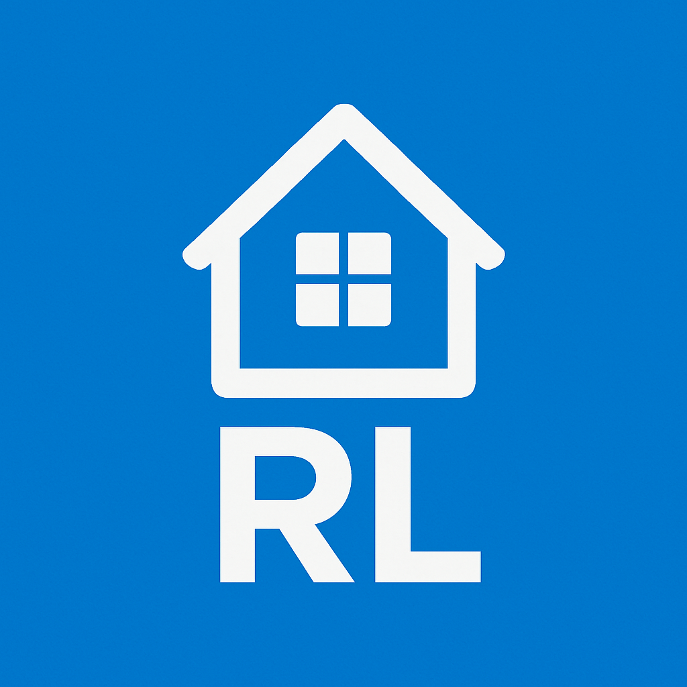
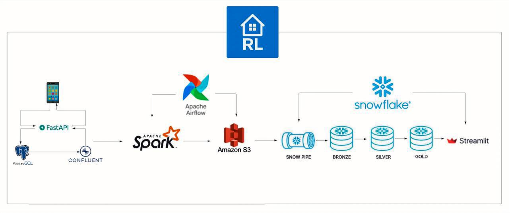
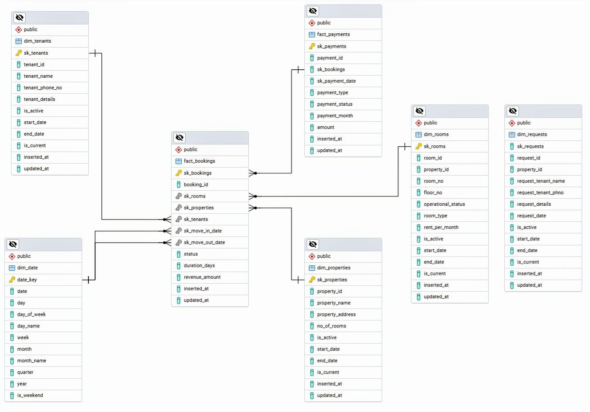
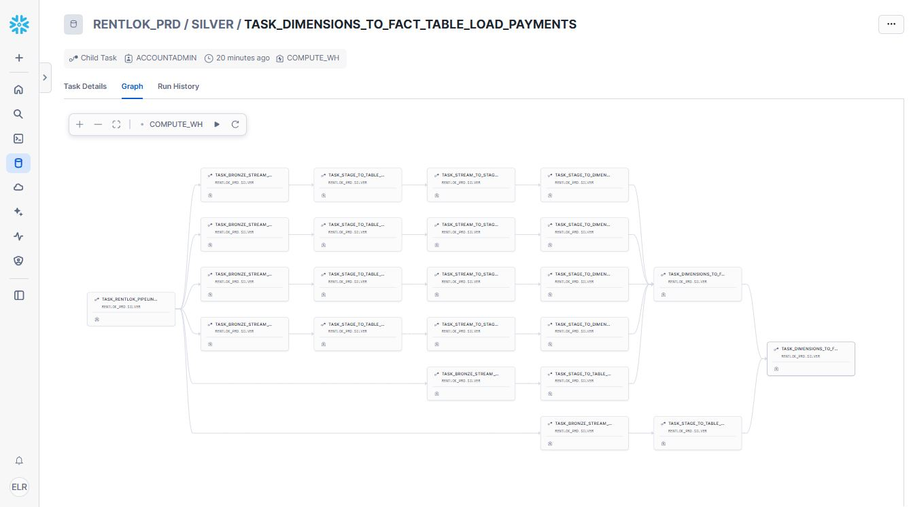
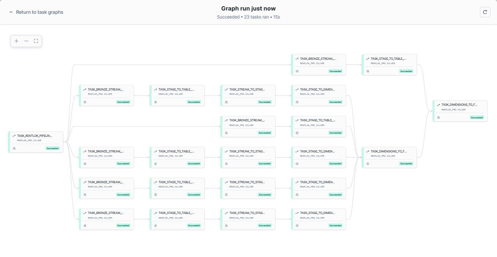
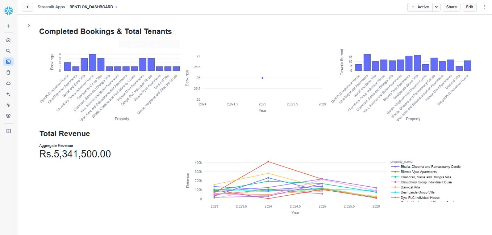

<p align="center">
  
</p>

# 🔍 RentLok Insights: OLAP Analytics (v1.0)📈

Building on our **OLTP** foundation (“RentLok: Rental Management System”), this repository delivers a full‑fledged OLAP pipeline in Snowflake to turn raw rental events into analytics‑ready insights. We ingest CSVs from AWS S3 into Bronze tables, cleanse and conform in Silver, and implement SCD Type II dimensions and fact tables in Gold—then surface key metrics via views and a Streamlit dashboard.

🚀 **Key Takeaways**
- **Snowflake ELT Architecture**: Bronze–Silver–Gold layering with Snowpipes, Stages, Streams, Sequences and Tasks for reliable, incremental loads  
- **Dimensional Modeling**: SCD Type II dimensions (`dim_properties`, `dim_rooms`, `dim_tenants`, `dim_requests`, `dim_date`) and star‑schema fact tables (`fact_bookings`, `fact_payments`) 
- **Advanced Transformations**: Idempotent MERGE logic, surrogate key management, clustering strategies for performance  
- **Aggregates & BI**: Views for monthly/yearly revenue, request trends, bookings and tenants trend
- **Dashboarding**: Snowflake‑embedded Streamlit integration with real‑time charts and KPI cards driven by pre‑aggregated views   

## 🚀 Features

- **End‑to‑End ELT**  
  - Automated ingestion from AWS S3 into Snowflake via Snowpipes  
  - Bronze–Silver–Gold layering with Streams and Tasks  

- **Incremental & Idempotent Loads**  
  - Change‑data capture using Snowflake Streams  
  - Merge‑based upserts for Silver and SCD Type II in Gold  

- **Dimensional Modeling**  
  - Star schema with SCD Type II dimensions 
  - Fact tables for bookings and payments with surrogate keys and business keys  

- **Performance Optimization**  
  - Clustering on business keys and date columns  
  - Normal views for pre‑aggregated metrics  

- **BI & Dashboarding**  
  - Streamlit dashboards embedded in Snowflake for real‑time KPIs  
  - Prebuilt aggregates: revenue trends, request heatmaps, occupancy rates  

- **Orchestration**  
  - Airflow + Spark to extract from PostgreSQL, transform to CSV, and load to S3  
  - Snowflake Tasks for downstream ELT orchestration  

---

## 🏛 System Architecture

<div align="center">
  
</div>

1. **Source Extraction (Airflow & Spark)**  
   - Airflow DAG extracts transactional data from PostgreSQL  
   - Apache Spark jobs transform tables into partitioned CSVs  

2. **Landing Zone (AWS S3)**  
   - Spark writes CSVs to `s3://rentlok/{table}/` with date‑stamped filenames  

3. **Bronze Layer (Snowflake)**  
   - Snowpipes auto‑ingest new CSVs into raw Bronze tables  
   - Streams capture INSERT/UPDATE events  

4. **Silver Layer**  
   - Cleansed, strongly‑typed “current state” tables  
   - Merge logic applies business rules, null‑handling, surrogate keys  
   - Streams on Silver track changes for SCD processing  

5. **Gold Layer**  
   - SCD Type II dimensions maintain full change history  
   - Fact tables capture booking/payment events, join to dimensions  
   - Normal views pre‑compute key metrics for analytics  

6. **Dashboarding (Streamlit in Snowflake)**  
   - Streamlit app queries materialized views for fast rendering  
   - Interactive charts: revenue by property, total bookings per property etc 

```All ELT steps in Snowflake are orchestrated via Tasks, with a master Airflow DAG handling the upstream extract‑transform‑load into S3.```

## 🛠️ Snowflake Setup Instructions

This repository is designed to run entirely within a single Snowflake environment. All setup scripts live in the `scripts/` folder and are numbered to indicate execution order. Simply connect to your Snowflake account open sql worksheet and run contents of each script in ascending order:

1. `Required_objects.sql`  
2. `Bronze_Tables&Streams.sql`  
3. `Bronze_Snowpipes.sql`  
4. `Bronze_Streams_to_Stage_load.sql`  
5. `Silver_Tables&Streams.sql`  
6. `Silver_Stage_to_table_Stream_to_stage_load..sql`  
7. `Gold_Tables&Sequences.sql`  
8. `Silver_stage_to_dimensional&Fact_tables_load.sql`  
9. `Aggregates_views_for_dashboard.sql`  

Once all scripts complete successfully, your OLAP pipeline objects—databases, schemas, tables, sequences, pipes, streams, tasks, and views—will be in place and ready to run.

## 📥 Injecting Sample Data into Bronze Tables

To quickly test your objects and see results, download the sample CSVs from the `dataset/` folder and use Snowsight’s **Load Table → Load from File** option to upload each file into the matching Bronze table. Run the root task and see the magic.  

---

## 📊 Star Schema ERD in Gold Layer

<div align="center">
  
</div>

---

## 🔄 Task Orchestration DAG

<div align="center">
  
</div>

---

## ✅ Successful Task Run

<div align="center">
  
</div>

---

## 🌐 Setup of Streamlit App in Snowflake

To visualize the final insights from the OLAP pipeline, you can create a native Streamlit app directly within Snowflake:

1. Open **Snowsight** and go to the **Projects** section.  
2. Click **+ Create** → **Streamlit App**.  
3. Choose the appropriate role, database (`RENTLOK_PRD`), and schema (`GOLD`).  
4. Name your app (e.g. `RentLok_Dashboard`).  
5. In the editor, paste the Streamlit dashboard code provided in the `Scripts/` folder of this repo.  
6. Click **Run** to launch your interactive dashboard.

> 🎥 *Tip:* Check out the recorded Streamlit dashboard walkthrough in this repo for a demo of the final analytics views. (See [`Assets/Rentlok_Streamlit_App.mp4`](Assets/Rentlok_Streamlit_App.mp4))

## 📈 Streamlit Dashboard Previews

<table>
  <tr>
    <td></td>
    <td style="padding-left;"></td>
  </tr>
</table>

---

## 🔮 Future Enhancements

This pipeline represents a working prototype of an end-to-end Snowflake OLAP system for RentLok. As the product evolves, additional business logic, data validations, and advanced metrics will be added to support richer dashboards and deeper analytical use cases. Future plans include:

- Enhanced revenue forecasting models  
- Occupancy trend predictions  
- Alerting for low-performing properties  
- CI/CD integration for Snowflake object deployment  

---

## 🎓 Key Learnings

This project was an in-depth, hands-on journey into modern data warehousing using **Snowflake**, covering:

- Full lifecycle of ELT using **Bronze–Silver–Gold architecture**
- Leveraging **Snowpipes**, **Streams**, and **Tasks** for event-driven data loading
- Implementing **SCD Type II** logic using MERGE statements and surrogate keys
- Designing and managing **dimensional models and fact tables**
- Optimizing performance with **clustering**, **primary keys**, and **views**
- Building a complete **BI dashboard in Snowflake** using Streamlit

It strengthened my end-to-end understanding of how data moves through a production-grade warehouse—ideal for roles focused on **data engineering**, **analytics engineering**, and **Snowflake platform development**.

---

## 🤝 Connect With Me

If you liked this project or are hiring for Snowflake or Data Engineering roles, feel free to connect:

- 💼 [LinkedIn](https://www.linkedin.com/in/eegapuri-lokeshwar-reddy-281327308)
- 📧 elokesh4292@gmail.com


